# NCCL System Architecture

## High-Level Architecture Overview

```mermaid
graph TB
    subgraph Client Application
        NCCL_API[ncclAllReduce<br/>ncclBroadcast<br/>ncclReduce...]
    end

    subgraph NCCL Library Core
        API_Layer[API Layer<br/>src/collectives.cc]
        Enqueue_Layer[Enqueue Layer<br/>src/enqueue.cc]
        Planning_Layer[Planning Layer<br/>src/graph/]
        Execution_Layer[Execution Layer<br/>src/device/]

        API_Layer --> Enqueue_Layer
        Enqueue_Layer --> Planning_Layer
        Planning_Layer --> Execution_Layer
    end

    subgraph Transport Layer
        Transport_API[Transport API<br/>src/transport/transport.cc]
        P2P[GPU P2P<br/>transport/p2p.cc]
        SHM[Shared Memory<br/>transport/shm.cc]
        NET_IB[InfiniBand<br/>transport/net_ib.cc]
        NET_TCP[TCP Sockets<br/>transport/net_socket.cc]
        NVLS[NVLink Switch<br/>transport/nvls.cc]
        COLNET[CollNet<br/>transport/coll_net.cc]

        Transport_API --> P2P
        Transport_API --> SHM
        Transport_API --> NET_IB
        Transport_API --> NET_TCP
        Transport_API --> NVLS
        Transport_API --> COLNET
    end

    subgraph Device Kernel Layer
        Kernel_API[Kernel API<br/>src/device/]
        AllReduce_Kernel[AllReduce Kernel<br/>src/device/all_reduce.h]
        AllGather_Kernel[AllGather Kernel<br/>src/device/all_gather.h]
        ReduceScatter_Kernel[ReduceScatter Kernel<br/>src/device/reduce_scatter.h]
        Broadcast_Kernel[Broadcast Kernel<br/>src/device/broadcast.h]
        CodeGen[Code Generator<br/>src/device/generate.py]

        Kernel_API --> AllReduce_Kernel
        Kernel_API --> AllGather_Kernel
        Kernel_API --> ReduceScatter_Kernel
        Kernel_API --> Broadcast_Kernel
        CodeGen --> AllReduce_Kernel
        CodeGen --> AllGather_Kernel
        CodeGen --> ReduceScatter_Kernel
        CodeGen --> Broadcast_Kernel
    end

    subgraph Memory & Resource Management
        Allocator[src/allocator.cc]
        Register[src/register/]
        Channel_Mgmt[Channel Management]
        Proxy_Thread[Proxy Thread
(src/proxy.cc)]
    end

    subgraph Plugin System
        Net_Plugin[Network Plugin<br/>ext-net/]
        Profiler_Plugin[Profiler Plugin<br/>ext-profiler/]
        Tuner_Plugin[Tuner Plugin<br/>ext-tuner/]
    end

    subgraph Hardware & System
        GPU[GPU Devices]
        NVLINK[NVLink Interconnect]
        PCIE[PCIe Bus]
        IB[InfiniBand<br/>Network]
        TCP[TCP/IP Network]
    end

    Client Application --> API_Layer
    Planning_Layer --> Transport_API
    Execution_Layer --> Kernel_API
    Execution_Layer --> Channel_Mgmt
    Channel_Mgmt --> Transport_API
    Transport_API --> Proxy_Thread
    Proxy_Thread --> GPU

    P2P --> GPU
    P2P --> PCIE
    SHM --> PCIE

    NET_IB --> IB
    NET_TCP --> TCP

    NVLS --> GPU
    NVLS --> NVLINK

    COLNET --> GPU
    COLNET --> IB

    Plugin_System --> Transport_API

    Memory_&_Resource_Management --> GPU
```

## Layered Architecture Detail

```
┌─────────────────────────────────────────────────────────────────────┐
│                      Client Application Layer                       │
│   PyTorch, TensorFlow, MPI, or Direct NCCL API Calls                │
└─────────────────────────────────────────────────────────────────────┘
                                 │
                                 ▼
┌─────────────────────────────────────────────────────────────────────┐
│                      NCCL API Layer (Host)                          │
│  src/collectives.cc - Public API Implementation                      │
│  - ncclAllReduce(), ncclBroadcast(), ncclAllGather(), etc.          │
│  - Validates parameters and creates ncclInfo structs                │
└─────────────────────────────────────────────────────────────────────┘
                                 │
                                 ▼
┌─────────────────────────────────────────────────────────────────────┐
│                      Enqueue Layer (Host)                           │
│  src/enqueue.cc - Kernel Launch Management                          │
│  - CUDA Stream synchronization                                      │
│  - Validation and error checking                                    │
│  - Queue management for operations                                  │
└─────────────────────────────────────────────────────────────────────┘
                                 │
                                 ▼
┌─────────────────────────────────────────────────────────────────────┐
│                      Planning Layer (Host)                          │
│  src/graph/ - Topology and Algorithm Selection                      │
│  - Topology detection (GPUs, PCIe, NVLink, Network)                │
│  - Algorithm selection (Ring, Tree, NVLS, CollNet)                 │
│  - Protocol selection (LL, LL128, Simple)                          │
│  - Channel allocation and optimization                              │
└─────────────────────────────────────────────────────────────────────┘
                                 │
                                 ▼
┌─────────────────────────────────────────────────────────────────────┐
│                      Execution Layer (GPU)                          │
│  src/device/ - Kernel Launch and Management                         │
│  - Generated specialized kernels                                    │
│  - Transport coordination                                           │
│  - Memory management                                                │
└─────────────────────────────────────────────────────────────────────┘
                                 │
                                 ▼
┌─────────────────────────────────────────────────────────────────────┐
│                    Transport Layer (Host/Device)                    │
│  Per-rank communication paths                                       │
│  ┌─────────────┐  ┌─────────────┐  ┌──────────────┐              │
│  │    GPU 0    │  │    GPU 1    │  │    GPU N     │              │
│  │             │  │             │  │              │              │
│  │ ┌────────┐  │  │ ┌────────┐  │  │ ┌─────────┐  │              │
│  │ │  P2P   │◄─┼──┼─►  P2P   │◄─┼──┼─►   SHM   │  │              │
│  │ │  SHM   │  │  │ │  SHM   │  │  │ │  NET_*  │  │              │
│  │ └────────┘  │  │ └────────┘  │  │ └─────────┘  │              │
│  └─────────────┘  └─────────────┘  └──────────────┘              │
│         │               │                │                          │
│         └──────┬────────┴────────────────┴──────┬─────────────────┘
│                │                               │
│         ┌──────▼────────┐              ┌───────▼──────┐            │
│         │   NVLink/PCI  │              │    Network   │            │
│         │  Connection   │              │  (IB/TCP)    │            │
│         └───────────────┘              └──────────────┘            │
└─────────────────────────────────────────────────────────────────────┘
```

## Transport Layer Details

```mermaid
graph LR
    subgraph Transport Selection
        Transport_API[Transport API
src/transport/transport.cc]

        Transport_API --> Priority1[P2P Direct
Highest Priority]
        Transport_API --> Priority2[Shared Memory
Second Priority]
        Transport_API --> Priority3[Network
Third Priority]
        Transport_API --> Priority4[CollNet
(SHARP/NVLS)]
    end

    subgraph P2P Transport
        Priority1 --> P2P[GPU P2P
src/transport/p2p.cc]
        P2P --> P2P_DIRECT[P2P_DIRECT
CUDA IPC Access]
        P2P --> P2P_IPC[P2P_IPC
Inter-Process Sharing]
        P2P --> P2P_CUMEM[P2P_CUMEM
CUDA Memory Handles]
        P2P --> P2P_INTER[P2P_INTERMEDIATE
Copy Engine Assist]
    end

    subgraph Shared Memory
        Priority2 --> SHM[Shared Memory
src/transport/shm.cc]
        SHM --> SHM_Loc[Lock-Free
Ring Buffers]
        SHM --> SHM_P2P[GPU Memory
via PCIe]
    end

    subgraph Network Transport
        Priority3 --> NET_IB[InfiniBand
src/transport/net_ib.cc]
        Priority3 --> NET_TCP[TCP Socket
src/transport/net_socket.cc]

        NET_IB --> IB_RDMA[RDMA
Memory Registration]
        NET_IB --> IB_MemCache[Memory Cache
ncclIbMrCache]

        NET_TCP --> TCP_Fallback[TCP/IP
Fallback Transport]
    end

    subgraph Hardware Offload
        Priority4 --> NVLS[NVLink SHARP
src/transport/nvls.cc]
        Priority4 --> COLNET[CollNet
src/transport/coll_net.cc]

        NVLS --> NVLS_HW[NVSwitch
Multicast]
        COLNET --> COLNET_SHARP[IB SHARP
In-Network Reduce]
    end
```

## Code Generation Pipeline

```
┌────────────────────────────────────────────────────────────────────┐
│              Code Generation System (src/device/)                   │
│                   generate.py - Main Generator                      │
└────────────────────────────────────────────────────────────────────┘
                                  │
                                  ▼
┌────────────────────────────────────────────────────────────────────┐
│                    Kernel Template Instantiation                    │
│  ┌────────────┐  ┌────────────┐  ┌──────────────┐  ┌─────────┐   │
│  │ Collective │× │ RedOp     │× │ DataType    │× │ Protocol│  │
│  │            │  │ (Sum/Min) │  │ (f32/f16/i32)│  │ (LL/LL128│  │
│  │ AllReduce  │  │ AllGather │  │              │  │ /Simple) │  │
│  │ Reduce     │  │ Broadcast │  │              │  │          │  │
│  └────────────┘  └────────────┘  └──────────────┘  └─────────┘   │
│                                                                      │
│  Example: AllReduce + Sum + float32 + LL128 => Specialized Kernel  │
└────────────────────────────────────────────────────────────────────┘
                                  │
                                  ▼
┌────────────────────────────────────────────────────────────────────┐
│                      Equivalence Class Mapping                      │
│  ┌─────────────────────────────────────────────────────────────┐   │
│  │  Similar Operations Share Kernel Implementations           │   │
│  │  Examples:                                                 │   │
│  │  - signed/unsigned int for sum/product operations          │   │
│  │  - 32-bit types with equivalent bit patterns               │   │
│  └─────────────────────────────────────────────────────────────┘   │
└────────────────────────────────────────────────────────────────────┘
                                  │
                                  ▼
┌────────────────────────────────────────────────────────────────────┐
│                   Kernel Specialization (best_kernel)               │
│  ┌─────────────────────────────────────────────────────────────┐   │
│  │  Architecture-Specific Optimizations                        │   │
│  │  - Loop unrolling based on GPU architecture                │   │
│  │  - Vector width optimization (BytePack<16>)                │   │
│  │  - Thread count optimization                               │   │
│  └─────────────────────────────────────────────────────────────┘   │
└────────────────────────────────────────────────────────────────────┘
                                  │
                                  ▼
┌────────────────────────────────────────────────────────────────────┐
│                  CUDA Architecture Filtering                        │
│  ┌─────────────────────────────────────────────────────────────┐   │
│  │  Only Generate Kernels Supported by Target Architecture     │   │
│  │  - SM70 kernels for Volta, SM80 for Ampere, SM90 for Hopper │   │
│  │  - Automatic filtering based on NVCC_GENCODE               │   │
│  └─────────────────────────────────────────────────────────────┘   │
└────────────────────────────────────────────────────────────────────┘
                                  │
                                  ▼
┌────────────────────────────────────────────────────────────────────┐
│                    Generated Kernel Files (.cu)                     │
│  - Collectives device generation/all_reduce.cu                      │
│  - Collectives device generation/all_gather.cu                      │
│  - Collectives device generation/reduce_scatter.cu                  │
│  - Collectives device generation/broadcast.cu                       │
└────────────────────────────────────────────────────────────────────┘
```

## AllReduce Algorithm Implementations

```mermaid
graph TD
    subgraph Algorithm Selection
        AlgoSel[Algorithm Selection
src/enqueue.cc]

        AlgoSel --> RingAlgo[Ring Algorithm
Default/Bandwidth]
        AlgoSel --> TreeAlgo[Tree Algorithm
Latency-Optimal]
        AlgoSel --> NVLSAlgo[NVLS Algorithm
NVLink Switch]
        AlgoSel --> CollNetAlgo[CollNet_DIRECT Algorithm
Network Offload]
    end

    subgraph Ring Algorithm Steps
        RingAlgo --> RingStep1[Reduce-Scatter Phase]
        RingAlgo --> RingStep2[All-Gather Phase]

        RingStep1 --> RingFlow1[Each rank reduces
assigned chunk]
        RingStep1 --> RingFlow2[Data forwarded
in ring topology]

        RingStep2 --> RingFlow3[Broadcast final
reduced chunks]
        RingStep2 --> RingFlow4[All ranks receive
final result]
    end

    subgraph Tree Algorithm Steps
        TreeAlgo --> TreeStep1[Reduce-Up Phase]
        TreeAlgo --> TreeStep2[Broadcast-Down Phase]

        TreeStep1 --> TreeFlow1[Leaf sends to parent]
        TreeStep1 --> TreeFlow2[Intermediate reduces
and forwards]

        TreeStep2 --> TreeFlow3[Root broadcasts
final result]
        TreeStep2 --> TreeFlow4[Tree propagation
to all leaves]
    end

    subgraph NVLS Algorithm Steps
        NVLSAlgo --> NVLSSingle[Single-Node]
        NVLSAlgo --> NVLSMulti[Multi-Node]

        NVLSSingle --> NVLSSingle1[NVSwitch direct
multicast reduce]
        NVLSSingle --> NVLSSingle2[Multicast memory
for efficiency]

        NVLSMulti --> NVLSMulti1[Local NVLS
reduction]
        NVLSMulti --> NVLSMulti2[Inter-node
communication]
    end

    subgraph CollNet Algorithm Steps
        CollNetAlgo --> CollStep1[Scatter Phase]
        CollNetAlgo --> CollStep2[Network Reduction]
        CollNetAlgo --> CollStep3[Gather Phase]

        CollStep1 --> CollFlow1[Distribute to
reduction heads]
        CollStep2 --> CollFlow2[IB SHARP performs
in-network reduce]
        CollStep3 --> CollFlow3[Collect reduced
results]
    end
```



## Memory Flow in AllReduce Operation

```
┌────────────────────────────────────────────────────────────────────┐
│                    AllReduce Memory Flow Pattern                    │
│             (Example: 4 GPUs, Ring Algorithm, Reduce-Scatter)      │
└────────────────────────────────────────────────────────────────────┘

  GPU 0 (Rank 0)          GPU 1 (Rank 1)          GPU 2 (Rank 2)          GPU 3 (Rank 3)
┌─────────────────┐      ┌─────────────────┐      ┌─────────────────┐      ┌─────────────────┐
│ Input Buffer:   │      │ Input Buffer:   │      │ Input Buffer:   │      │ Input Buffer:   │
│ [A0][B0][C0][D0]│      │ [A1][B1][C1][D1]│      │ [A2][B2][C2][D2]│      │ [A3][B3][C3][D3]│
└────────┬────────┘      └────────┬────────┘      └────────┬────────┘      └────────┬────────┘
         │                        │                        │                        │
         │                        │                        │                        │
         ▼                        ▼                        ▼                        ▼
┌─────────────────┐      ┌─────────────────┐      ┌─────────────────┐      ┌─────────────────┐
│ Reduce-Scatter  │      │ Reduce-Scatter  │      │ Reduce-Scatter  │      │ Reduce-Scatter  │
│ Phase:          │      │ Phase:          │      │ Phase:          │      │ Phase:          │
│  ┌────────────┐ │      │  ┌────────────┐ │      │  ┌────────────┐ │      │  ┌────────────┐ │
│  │Owns chunk A│ │      │  │Owns chunk B│ │      │  │Owns chunk C│ │      │  │Owns chunk D│ │
│  └────────────┘ │      │  └────────────┘ │      │  └────────────┘ │      │  └────────────┘ │
│                 │      │                 │      │                 │      │                 │
│ [A0]─────────────┼──────►[A0+A1]─────────┼──────►[A0+A1+A2]──────┼──────►[A0+A1+A2+A3]   │
│      ╲          │      │         ╲       │      │           ╲     │      │                 │
│       ╲         │      │          ╲      │      │            ╲    │      │                 │
│        ╲        │      │           ╲     │      │             ╲   │      │                 │
│         ▼       │      │            ▼    │      │              ▼  │      │          ▲      │
│     [B0]────────┼──────►[B0+B1]─────────┼──────►[B0+B1+B2]─────┼──────►[B0+B1+B2+B3]││
│                 │      │                 │      │                 │      │          │      │
│                 │      │                 │      │                 │      │  Final   │      │
│     [C0─────────┼──────►[C0+C1]─────────┼──────►[C0+C1+C2]─────┼──────►[C0+C1+C2+C3]││
│                 │      │                 │      │                 │      │  Result  │      │
│                 │      │                 │      │                 │      │  (All-   │      │
│     [D0─────────┼──────►[D0+D1]─────────┼──────►[D0+D1+D2]─────┼──────►[D0+D1+D2+D3]││
│                 │      │                 │      │                 │      │  Gather) │      │
└─────────────────┘      └─────────────────┘      └─────────────────┘      └─────────────────┘
         │                        │                        │                        │
         └────────────────────────┴────────────────────────┴────────────────────────┘
                                  │
                                  ▼
┌────────────────────────────────────────────────────────────────────┐
│                    Output: A+B+C+D in all GPUs                      │
└────────────────────────────────────────────────────────────────────┘

Legend:
  ──>  Data flow direction (chunk moving through ring)
  A0   Data chunk A from GPU 0
  A0+A1  Reduction result (sum of A0 and A1)
```

## Topology Detection and Graph Structure

```mermaid
graph BT
    subgraph System Topology
        CPU[CPU Node(s)]
        RAM[System Memory]

        subgraph PCI Tree
            PCISW1[PCI Switch]
            PCISW2[PCI Switch]
            PCIBRG[PCI Bridge]
        end

        subgraph GPU Complex
            GPU0[GPU 0]<-->GPU1[GPU 1]
            GPU2[GPU 2]<-->GPU3[GPU 3]
            GPU0<-->GPU2
            GPU1<-->GPU3
        end

        subgraph NVSwitch
            NVSW1[NVSwitch 1]
            NVSW2[NVSwitch 2]
        end

        subgraph Network
            NIC1[NIC 1<br/>InfiniBand]
            NIC2[NIC 2<br/>InfiniBand]
        end
    end

    CPU --> PCISW1
    CPU --> PCISW2
    RAM --> CPU

    PCISW1 --> GPU0
    PCISW1 --> GPU1
    PCISW1 --> NIC1

    PCISW2 --> GPU2
    PCISW2 --> GPU3
    PCISW2 --> NIC2

    GPU0 --> NVSW1
    GPU1 --> NVSW1
    GPU2 --> NVSW2
    GPU3 --> NVSW2

    GPU0 --> GPU1
    GPU0 --> GPU2
    GPU1 --> GPU3
    GPU2 --> GPU3

    NIC1 -.-> IB[InfiniBand Fabric]
    NIC2 -.-> IB
    NVSW1 -.-> NVSW2
```

## Data Structures and Key Classes

```
┌────────────────────────────────────────────────────────────────────┐
│                    Core Data Structures                              │
├────────────────────────────────────────────────────────────────────┤
│                                                                      │
│  ncclInfo (src/include/collectives.h)                              │
│  ┌──────────────────────────────────────────────────────────────┐  │
│  │ struct ncclInfo {                                            │  │
│  │   ncclFunc_t coll;        // Collective function type       │  │
│  │   const char* opName;     // Operation name                 │  │
│  │   const void* sendbuff;   // Send buffer pointer            │  │
│  │   void* recvbuff;         // Receive buffer pointer         │  │
│  │   size_t count;           // Number of elements             │  │
│  │   ncclDataType_t datatype; // Data type (f32, f16, etc.)    │  │
│  │   ncclRedOp_t op;         // Reduction operation            │  │
│  │   ncclComm* comm;         // Communicator                   │  │
│  │   cudaStream_t stream;    // CUDA stream                    │  │
│  │   int chunksteps;         // Pipeline depth                 │  │
│  │   int slicesteps;         // Data slicing granularity       │  │
│  │ };                                                           │  │
│  └──────────────────────────────────────────────────────────────┘  │
│                                                                      │
│  ncclComm (src/include/core.h)                                      │
│  ┌──────────────────────────────────────────────────────────────┐  │
│  │ struct ncclComm {                                            │  │
│  │   int rank;                 // My rank in communicator      │  │
│  │   int nRanks;               // Total number of ranks        │  │
│  │   cudaStream_t stream;      // Default stream               │  │
│  │   ncclChannel* channels;    // Array of channels            │  │
│  │   int nChannels;            // Number of active channels    │  │
│  │   ncclTopoSystem* topo;     // Topology information         │  │
│  │   ncclProxyState* proxyState; // Proxy thread state         │  │
│  │   void* bootstrap;          // Bootstrap state             │  │
│  │   // ... additional fields                                  │  │
│  │ };                                                           │  │
│  └──────────────────────────────────────────────────────────────┘  │
│                                                                      │
│  ncclChannel (src/include/core.h)                                   │
│  ┌──────────────────────────────────────────────────────────────┐  │
│  │ struct ncclChannel {                                         │  │
│  │   int id;                   // Channel ID                   │  │
│  │   struct ncclRing ring;     // Ring topology                │  │
│  │   struct ncclTree tree;     // Tree topology                │  │
│  │   union ncclCollNet collnet; // CollNet topology            │  │
│  │   struct ncclNvls nvls;     // NVLS topology                │  │
│  │   struct ncclP2Plist* p2pList; // P2P connections           │  │
│  │   // ... connection info                                    │  │
│  │ };                                                           │  │
│  └──────────────────────────────────────────────────────────────┘  │
│                                                                      │
│  ncclRing / ncclTree (src/include/graph.h)                         │
│  ┌──────────────────────────────────────────────────────────────┐  │
│  │ struct ncclRing {                                            │  │
│  │   int nRanks;               // Number of ranks in ring      │  │
│  │   int* ring;                // Rank ordering                │  │
│  │   int* prev;                // Previous rank in ring        │  │
│  │   int* next;                // Next rank in ring            │  │
│  │ };                                                           │  │
│  │                                                              │  │
│  │ struct ncclTree {                                            │  │
│  │   int depth;                // Tree depth                   │  │
│  │   int* parent;              // Parent rank (-1 for root)   │  │
│  │   int** children;           // Child ranks                  │  │
│  │ };                                                           │  │
│  └──────────────────────────────────────────────────────────────┘  │
│                                                                      │
└────────────────────────────────────────────────────────────────────┘
```

## Plugin System Architecture

```mermaid
graph LR
    subgraph Plugin Interface Layer
        Plugin_IF[Plugin API Interface
src/include/plugin.h]
    end

    subgraph Network Plugin
        NetPlugin[Network Plugin API
ext-net/]
        NetPlugin --> NetAPI1[ncclNet_v10 API]
        NetAPI1 --> NetFuncs[
            connect()  accept()  listen()
            send()     recv()    flush()
            regMr()    deregMr()
        ]
        NetAPI1 --> CollAPI1[collNet API (Optional)]
    end

    subgraph Profiler Plugin
        ProfPlugin[Profiler Plugin API
ext-profiler/]
        ProfPlugin --> ProfAPI1[Profiler API]
        ProfAPI1 --> ProfFuncs[
            start()    stop()
            rank()     startColl()
            endColl()  log()
        ]
    end

    subgraph Tuner Plugin
        TunePlugin[Tuner Plugin API
ext-tuner/]
        TunePlugin --> TuneAPI1[Tuner API]
        TuneAPI1 --> TuneFuncs[
            init()     close()
            getCollInfo()
            requestColl()
        ]
    end

    Plugin_IF --> NetPlugin
    Plugin_IF --> ProfPlugin
    Plugin_IF --> TunePlugin

    subgraph NCCL Core
        NCCL_Funcs[NCCL API Functions]
        NCCL_Funcs --> Plugin_IF
    end

    subgraph Dynamic Loading
        DL[dlopen / dlsym
Dynamic Library Loading]
        DL --> PluginDiscovery[Plugin Discovery
libnccl-net*.so]
    end

    PluginDiscovery --> NetPlugin
```

## Key Performance Characteristics

```
┌────────────────────────────────────────────────────────────────────┐
│                    Performance Features                              │
├────────────────────────────────────────────────────────────────────┤
│                                                                      │
│  Pipeline Depth:                                                     │
│  ┌──────────────────────────────────────────────────────────────┐  │
│  │ NCCL_STEPS = 8 (default)                                     │  │
│  │                                                              │  │
│  │ Time ──►                                                      │  │
│  │ │ Step1 │ Step2 │ Step3 │ Step4 │ Step5 │ Step6 │ Step7 │ Step8││  │
│  │  GPU0    GPU0    GPU0    GPU0    GPU0    GPU0    GPU0    GPU0 ││  │
│  │         GPU1    GPU1    GPU1    GPU1    GPU1    GPU1    GPU1 ││  │
│  │                 GPU2    GPU2    GPU2    GPU2    GPU2    GPU2 ││  │
│  │                         GPU3    GPU3    GPU3    GPU3    GPU3 ││  │
│  │                                                                 ││  │
│  │   ▲     ▲                                         ║           ║ ││  │
│  │   │     │                                         ║           ║ ││  │
│  │   │     └─────────────────────────────────────────╫───────────╫─┤│  │
│  │   │                                               ║           ║ ││  │
│  │   └───────────────────────────────────────────────╫───────────╫─┤│  │
│  │                                                     ║           ║ ││  │
│  └─────────────────────────────────────────────────────╫───────────╫─┤│  │
│                                                         ║           ║ ││  │
│   Pipelined execution for maximum bandwidth utilization   ║   ║   ║   ║ ││  │
│                                                            Data flows ││  │
└─────────────────────────────────────────────────────────────────────┘│  │
│                                                                      │
│  Thread Organization:                                                │
│  ┌──────────────────────────────────────────────────────────────┐  │
│  │ WARP_SIZE = 32 threads per warp                              │  │
│  │                                                              │  │
│  │ Warp 0 │ Warp 1 │ Warp 2 │ Warp 3 │ Warp 4 │ ... │ Warp N │  │
│  │  ──────────────────────────────────────────────────────────  │  │
│  │    Send      Recv      Comp      Scatter   Gather    ...    │  │
│  │  ──────────────────────────────────────────────────────────  │  │
│  │ Each warp has specialized role for NVLS optimizations        │  │
│  └──────────────────────────────────────────────────────────────┘  │
│                                                                      │
│  Memory Access Pattern:                                              │
│  ┌──────────────────────────────────────────────────────────────┐  │
│  │ Vectorized load/store with BytePack<16>                      │  │
│  │                                                              │  │
│  │ Count                1              2              3         │  │
│  │ Addr 0x1000  ┌─────────────┐ ┌─────────────┐ ┌─────────────┐│  │
│  │              │  128 bits   │ │  128 bits   │ │  128 bits   ││  │
│  │              │ (16 bytes)  │ │ (16 bytes)  │ │ (16 bytes)  ││  │
│  │ Addr 0x1020  └─────────────┘ └─────────────┘ └─────────────┘││  │
│  │              ───────────────────  ─────────────  ──────────   │  │
│  │              Burst read/write for maximum memory bandwidth   │  │
│  └──────────────────────────────────────────────────────────────┘  │
│                                                                      │
│  Protocol Thresholds:                                                │
│  ┌──────────────────────────────────────────────────────────────┐  │
│  │ Message Size                                                   │  │
│  │                                                                │  │
│  │ 0 ─────────────────────────────────────►  Large (MB+)         │  │
│  │  │                                                          │  │
│  │  │ LL128 Protocol   Simple Protocol                        │  │
│  │  │  (16B ops)      (Vectorized)                            │  │
│  │  └──────────────────┬───────────────────────────────────────┘  │
│  │                     NCCL_LL128_THRESHOLD                       │
│  │                     (default: ~8KB)                            │
│  │                                                                │
│  │  LL Protocol                                                   │
│  │  (8B ops)                                                      │
│  └─────────────────── NCCL_LL_THRESHOLD ─────────────────────────┘
│                      (default: ~4KB)                               │
│                                                                      │
│  Channel Scaling:                                                   │
│  ┌──────────────────────────────────────────────────────────────┐  │
│  │  ┌────────────────────────────────────────────────────────┐ │  │
│  │  │ Algorithm Selection (AllReduce)                       │ │  │
│  │  │                                                         │ │  │
│  │  │ NCCL_TREE_THRESHOLD                                     │ │  │
│  │  │  (default: ~1MB)                                       │ │  │
│  │  │   ╔══════════════════════════════════════╗            │ │  │
│  │  │   ║   Tree Algorithm (Low Latency)      ║            │ │  │
│  │  │   ║   - 2*log(N) steps                 ║            │ │  │
│  │  │   ║   - Small message optimization     ║            │ │  │
│  │  │   ╚══════════════════════════════════════╝            │ │  │
│  │  │   ╔══════════════════════════════════════╗            │ │  │
│  │  │   ║   Ring Algorithm (Bandwidth)       ║            │ │  │
│  │  │   ║   - 2*(N-1) steps                ║            │ │  │
│  │  └────────────────────────────────────────────────────────┘ │  │
│  └────────────────────────────────────────────────────────────────┘  │
│                                                                      │
└────────────────────────────────────────────────────────────────────┘
```

## File Organization Summary

```
nccl/
├── src/                                      # Source Code
│   ├── collectives.cc                       # Public API implementation
│   ├── enqueue.cc                           # Kernel launch & queue management
│   ├── include/
│   │   ├── core.h                          # Core definitions
│   │   ├── collectives.h                   # Collective operation interfaces
│   │   ├── device.h                        # Device-side API
│   │   └── plugin.h                        # Plugin API definitions
│   │
│   ├── device/                              # GPU Kernel implementations
│   │   ├── generate.py                     # Code generator
│   │   ├── common_kernel.h                 # Common kernel templates
│   │   ├── primitives.h                    # Communication primitives
│   │   ├── all_reduce.h                    # AllReduce algorithm kernels
│   │   ├── all_gather.h                    # AllGather algorithm kernels
│   │   ├── reduce_scatter.h                # ReduceScatter kernels
│   │   └── broadcast.h                     # Broadcast algorithm kernels
│   │
│   ├── transport/                          # Communication transport layer
│   │   ├── transport.cc                    # Transport selection & API
│   │   ├── p2p.cc                          # GPU peer-to-peer transport
│   │   ├── shm.cc                          # Shared memory transport
│   │   ├── net_ib.cc                       # InfiniBand transport
│   │   ├── net_socket.cc                   # TCP socket transport
│   │   ├── nvls.cc                         # NVLink Switch transport
│   │   └── coll_net.cc                     # CollNet transport
│   │
│   ├── graph/                              # Topology & algorithm selection
│   │   ├── topo.cc                         # Topology detection
│   │   ├── tuning.cc                       # Algorithm selection
│   │   ├── search.cc                       # Optimal graph search
│   │   ├── xml.cc                          # Topology XML parsing
│   │   └── rocks/                          # Auto-tuning database
│   │
│   ├── plugin/                             # Plugin interface layer
│   │   ├── plugin.cc                       # Plugin API implementation
│   │   └── load_ctors.cc                   # Plugin constructors
│   │
│   ├── register/                           # Memory registration for RDMA
│   │   ├── ib_reg_mr.cc                    # InfiniBand memory registration
│   │   └── shm_reg_mr.cc                   # Shared memory registration
│   │
│   ├── proxy.cc                            # Proxy thread for async operations
│   ├── allocator.cc                        # Memory allocator
│   ├── init.cc                             # Initialization
│   └── bootstrap.cc                        # Bootstrap communication
│
├── ext-net/                                # Network plugin examples
├── ext-profiler/                          # Profiler plugin examples
├── ext-tuner/                             # Tuner plugin examples
│
├── makefiles/                             # Build system
│   ├── version.mk                        # Version definition
│   ├── common.mk                         # Common build rules
│   └── [platform-specific *.mk files]
│
├── docs/                                  # Documentation
│   └── nccl-architecture.md              # This file
│
└── build/                                 # Build output directory
    ├── lib/
    │   ├── libnccl.so                    # Main shared library
    │   └── libnccl_static.a              # Static library
    ├── include/
    │   └── nccl.h                        # Public API header
    └── bin/
        └── ncclras                       # RAS (Reliability) client
```

---

*Last Updated: 2026-02-04*
*NCCL Version: 2.29.3*
