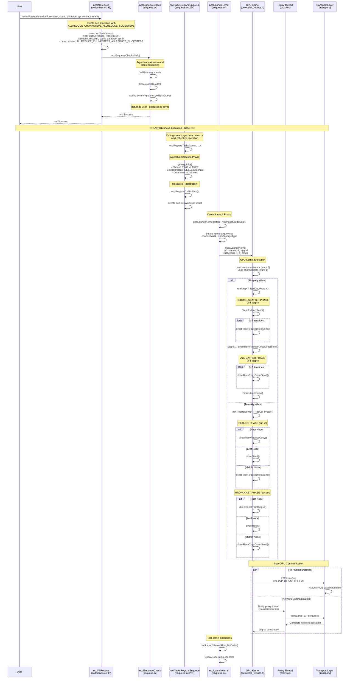
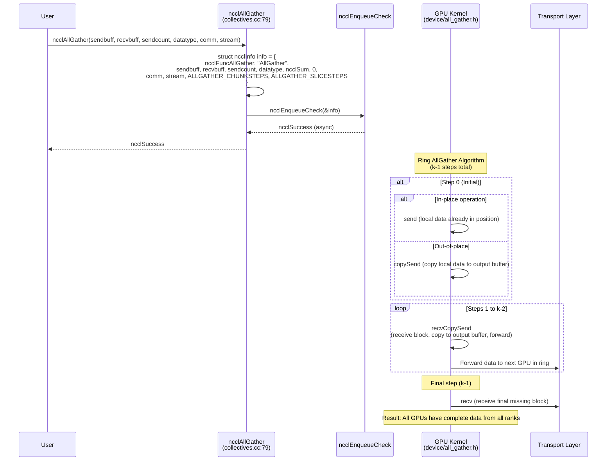
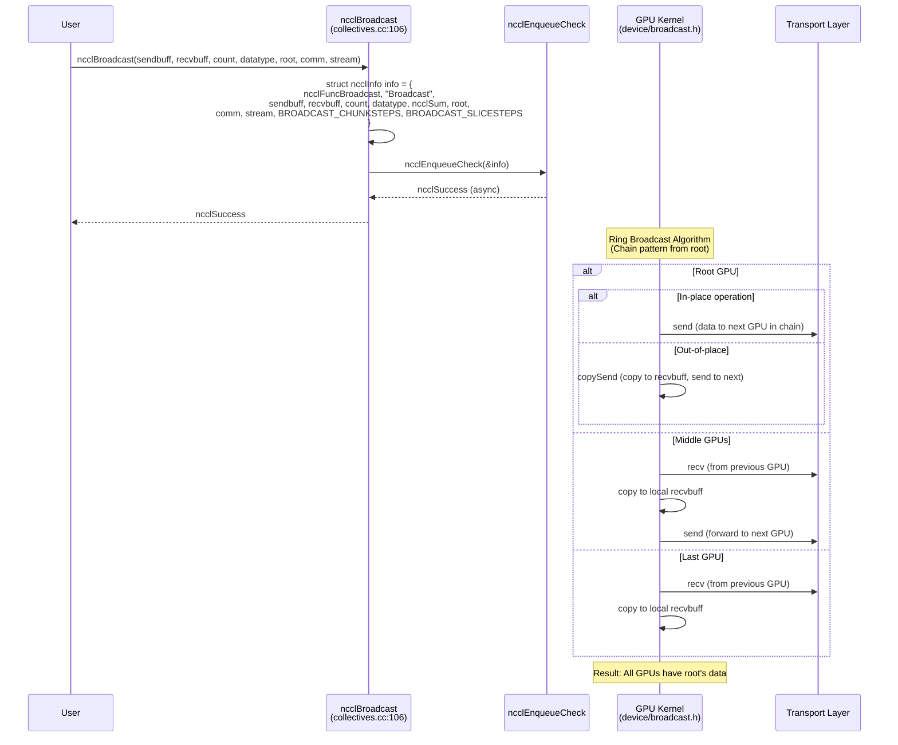
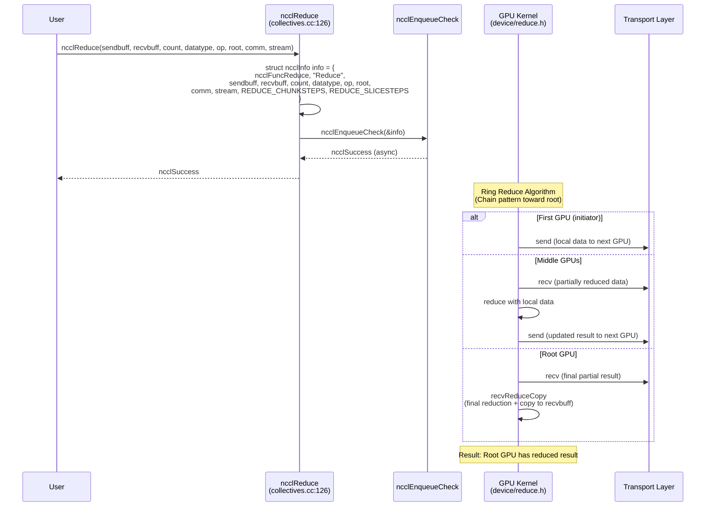
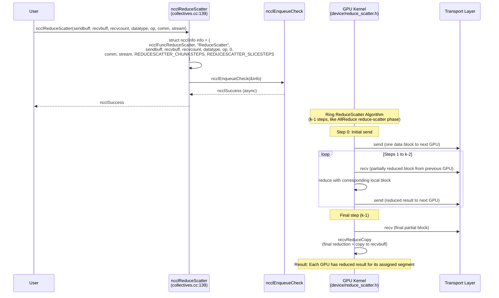
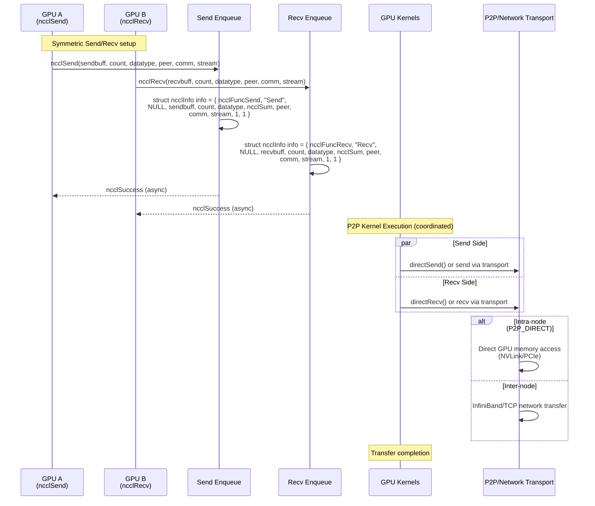
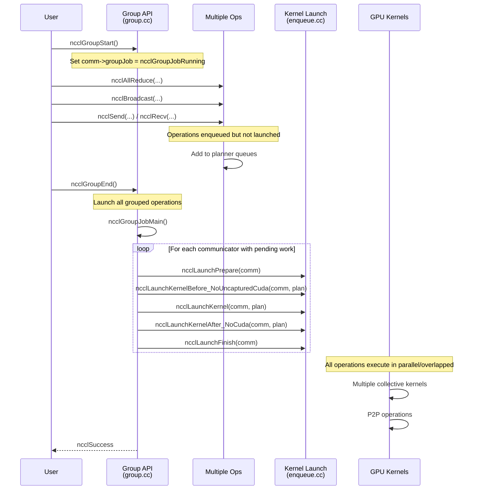

# NCCL Call Flow UML Sequence Diagrams

This document provides UML sequence diagrams for NCCL collective communication operations, illustrating the complete call flow from user API to kernel execution and network operations.

## Overview

NCCL collective operations follow a consistent pattern:
1. **API Layer**: User calls public NCCL API (e.g., `ncclAllReduce`)
2. **Enqueue Layer**: Validation and task preparation (`ncclEnqueueCheck`)
3. **Planning Layer**: Algorithm selection and resource allocation
4. **Launch Layer**: Kernel launch preparation and execution
5. **Device Layer**: GPU kernel execution with primitives
6. **Proxy Layer**: Network operations via proxy threads

---

## AllReduce Call Flow Diagram

---

## AllGather Call Flow Diagram

---

## Broadcast Call Flow Diagram  

---

## Reduce Call Flow Diagram

---

## ReduceScatter Call Flow Diagram

---

## Point-to-Point Communication Diagram

---

## Group Operations Call Flow

---

## Key Implementation Notes

### Common Flow Pattern
All collective operations follow the same basic pattern:
1. **API validation** and `ncclInfo` struct creation
2. **Enqueue** via `ncclEnqueueCheck` (returns immediately)
3. **Asynchronous execution** triggered by stream sync or next operation
4. **Algorithm selection** and resource planning
5. **Kernel launch** with specialized device functions
6. **Transport-specific** communication (P2P, network, shared memory)

### Critical Constants from Source
- `ALLREDUCE_CHUNKSTEPS = NCCL_STEPS/2 = 4`
- `ALLREDUCE_SLICESTEPS = NCCL_STEPS/4 = 2`  
- `NCCL_STEPS = 8` (pipeline depth)
- Grid dimension: `(nChannels, 1, 1)`
- Block dimension: `(threadPerBlock, 1, 1)`

### Transport Integration
- **P2P_DIRECT**: Direct GPU-to-GPU within same process
- **P2P via FIFO**: GPU→FIFO→GPU with intermediate buffering  
- **Network**: GPU→Proxy Thread→Network→Remote Proxy→Remote GPU
- **Shared Memory**: GPU→CPU→Shared Memory→Remote CPU→Remote GPU

### Algorithm Selection Logic
The diagrams show simplified algorithm selection. Actual selection considers:
- Message size thresholds
- Available hardware (NVLink, InfiniBand)  
- Topology (intra-node vs inter-node)
- Protocol capabilities (LL128 requirements)
- Performance tuning parameters

These diagrams provide the complete call flow understanding needed for debugging, optimization, and extending NCCL collective operations.